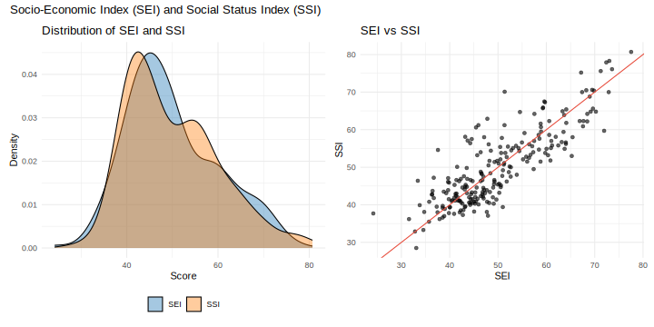

# Occupational Scales for Japanese society

Socio-Economic Index (SEI) and Social Status Index (SSI) for Japanese society.

## References

- Fujihara, Sho. 2020. "Socio-Economic Standing and Social Status in Contemporary Japan: Scale Constructions and Their Applications." *European Sociological Review* 36(4):548–561. DOI: [10.1093/esr/jcaa010](https://doi.org/10.1093/esr/jcaa010)
- Song, Xi, and Yu Xie. 2023. "Occupational Percentile Rank: A New Method for Constructing a Socioeconomic Index of Occupational Status." *Sociological Methods & Research*. doi:10.1177/00491241231207914.
- Oesch, Daniel, Oliver Lipps, Roujman Shahbazian, Erik Bihagen, and Katy Morris. 2025. "Occupational Earning Potential: A New Measure of Social Hierarchy in Europe and the US." *European Sociological Review*. doi:10.1093/esr/jcaf035.

## Data Files

### JESS (Employment Status Survey / Population Census)

| File | Description |
|------|-------------|
| `JESS_232_sei_ssi_v1.0.csv` | SEI and SSI for 231 occupations |
| `JESS_sei_ssi_v1.0.csv` | SEI and SSI (detailed version) |
| `JESS_occupational_scales_v0.3.csv` | **NEW**: Gender-Specific SEI (MSEI/FSEI) and other scales |

Note: The original classification has 232 occupation codes, but code 232 ("Workers not classifiable by occupation") is excluded from scale estimation, resulting in 231 occupations.

### SSM (Social Stratification and Social Mobility Survey)

| File | Description |
|------|-------------|
| `SSM_sei_ssi_v1.0.csv` | SEI and SSI for SSM occupational categories |

## Variables in `JESS_occupational_scales_v0.3.csv`

| Variable | Description |
|----------|-------------|
| `occ` | Occupation code |
| `title` | Occupation title |
| `prop` | Proportion of workers |
| `prop_women` | Proportion of women |
| **Education & Earnings** | |
| `Education` | Mean years of education of workers in the occupation |
| `Earnings` | Mean log earnings of workers in the occupation |
| **SEI Scores** | |
| `TSEI` | Total SEI (combined) |
| `MSEI` | Male-specific SEI |
| `FSEI` | Female-specific SEI |
| `TSEI_E`, `MSEI_E`, `FSEI_E` | Education component |
| `TSEI_I`, `MSEI_I`, `FSEI_I` | Income component |
| **Other Scales** | |
| `Prestige` | Occupational prestige |
| `Status` | Status index / CAMSIS |
| `DSEI` | Duncan-type SEI |
| `OPR` | Occupational Percentile Rank (Song and Xie 2023) |
| `OEP` | Occupational Earnings Percentile |
| `SIOPS` | Standard International Occupational Prestige Scale |
| `ISEI` | International Socio-Economic Index |
| `ICAMS` | International CAMSIS |
| `GOEP` | Global Occupational Earnings Percentile (Oesch et al. 2025) |

## External Scale Sources

- **SIOPS**: Treiman, Donald J. 1977. *Occupational Prestige in Comparative Perspective*. Academic Press.
- **ISEI**: Ganzeboom, Harry B.G., Paul M. De Graaf, and Donald J. Treiman. 1992. "A Standard International Socio-Economic Index of Occupational Status." *Social Science Research* 21(1):1-56.
- **ICAMS**: Lambert, Paul S., and Erik Bihagen. 2014. "Using Occupation-Based Social Classifications." *Work, Employment and Society* 28(3):481-494.

## Usage

```r
# Load the data
library(tidyverse)
scales <- read_csv("https://raw.githubusercontent.com/ShoFujihara/OccupationalScales/master/JESS_232_sei_ssi_v1.0.csv")

# Example: SEI vs SSI scatter plot
scales |>
  ggplot(aes(x = sei, y = ssi)) +
  geom_point() +
  geom_abline(slope = 1, intercept = 0, linetype = "dashed") +
  labs(x = "SEI", y = "SSI", title = "SEI vs SSI")
```


