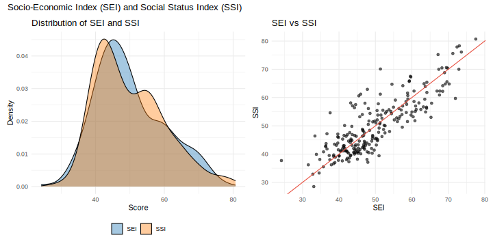

[Fujihara and Wong RC28.pdf](https://github.com/user-attachments/files/28058341/Fujihara.and.Wong.RC28.pdf)
# OSF draft
https://osf.io/96ajy/overview?view_only=979f4991bc594002b90c54295e4ebfba

[Uploading Fujihara and Wong RC28.pdf…]()

# Occupational Scales for Japanese society

Socio-Economic Index (SEI) and Social Status Index (SSI) for Japanese society.

## References

- Fujihara, Sho. 2020. "Socio-Economic Standing and Social Status in Contemporary Japan: Scale Constructions and Their Applications." *European Sociological Review* 36(4):548–561. DOI: [10.1093/esr/jcaa010](https://doi.org/10.1093/esr/jcaa010)
- Song, Xi, and Yu Xie. 2023. "Occupational Percentile Rank: A New Method for Constructing a Socioeconomic Index of Occupational Status." *Sociological Methods & Research*. doi:10.1177/00491241231207914.
- Oesch, Daniel, Oliver Lipps, Roujman Shahbazian, Erik Bihagen, and Katy Morris. 2025. "Occupational Earning Potential: A New Measure of Social Hierarchy in Europe and the US." *European Sociological Review*. doi:10.1093/esr/jcaf035.

## Data Files

### JESS (Employment Status Survey / Population Census)

| File | Description |
|------|-------------|
| `JESS_232_sei_ssi_v1.0.csv` | SEI and SSI for 231 occupations (v1.0) |
| `JESS_sei_ssi_v1.0.csv` | SEI and SSI, detailed version (v1.0) |
| `JESS_occupational_scales_v0.3.csv` | Gender-Specific SEI (MSEI/FSEI) and other scales (v0.3) |

Note: The original classification has 232 occupation codes, but code 232 ("Workers not classifiable by occupation") is excluded from scale estimation, resulting in 231 occupations. MSEI and FSEI are NA for occupations where one gender has too few workers for reliable estimation (2 occupations for MSEI, 9 for FSEI).

### SSM (Social Stratification and Social Mobility Survey)

| File | Description |
|------|-------------|
| `SSM_sei_ssi_v1.0.csv` | SEI and SSI for SSM occupational categories (v1.0) |
| `SSM_occupational_scales.csv` | Gender-Specific SEI and other scales for SSM categories |

Note: SSM occupational categories are mapped from JESS codes via a crosswalk. MSEI/FSEI are NA for categories that map exclusively to gender-sparse occupations.

## Variables in `JESS_occupational_scales_v0.3.csv`

| Variable | Description |
|----------|-------------|
| `occ` | Occupation code |
| `title` | Occupation title |
| `prop` | Proportion of workers |
| `prop_women` | Proportion of women |
| **Education & Earnings** | |
| `Education` | Mean years of education of workers in the occupation |
| `Earnings` | Mean log earnings of workers in the occupation |
| **SEI Scores** | |
| `TSEI` | Total SEI (combined) |
| `MSEI` | Male-specific SEI |
| `FSEI` | Female-specific SEI |
| `TSEI_E`, `MSEI_E`, `FSEI_E` | Education component |
| `TSEI_I`, `MSEI_I`, `FSEI_I` | Income component |
| **Other Scales** | |
| `Prestige` | Occupational prestige |
| `Status` | Status index / CAMSIS |
| `DSEI` | Duncan-type SEI |
| `OPR` | Occupational Percentile Rank (Song and Xie 2023) |
| `OEP` | Occupational Earnings Percentile |
| `SIOPS` | Standard International Occupational Prestige Scale |
| `ISEI` | International Socio-Economic Index |
| `ICAMS` | International CAMSIS |
| `GOEP` | Global Occupational Earnings Percentile (Oesch et al. 2025) |

## External Scale Sources

- **SIOPS**: Treiman, Donald J. 1977. *Occupational Prestige in Comparative Perspective*. Academic Press.
- **ISEI**: Ganzeboom, Harry B.G., Paul M. De Graaf, and Donald J. Treiman. 1992. "A Standard International Socio-Economic Index of Occupational Status." *Social Science Research* 21(1):1-56.
- **ICAMS**: Lambert, Paul S., and Erik Bihagen. 2014. "Using Occupation-Based Social Classifications." *Work, Employment and Society* 28(3):481-494.

## Usage

```r
library(tidyverse)
library(patchwork)

# Load the data
d <- read_csv("https://raw.githubusercontent.com/ShoFujihara/OccupationalScales/master/JESS_232_sei_ssi_v1.0.csv")

# Distribution plot (density curves)
p1 <- d |>
  select(sei, ssi) |>
  pivot_longer(cols = everything(), names_to = "index", values_to = "value") |>
  mutate(index = toupper(index)) |>
  ggplot(aes(x = value, fill = index)) +
  geom_density(alpha = 0.4) +
  scale_fill_manual(values = c("SEI" = "#1F77B4", "SSI" = "#FF7F0E")) +
  labs(title = "Distribution of SEI and SSI", x = "Score", y = "Density", fill = NULL) +
  theme_minimal() +
  theme(legend.position = "bottom")

# Scatter plot (SEI vs SSI)
p2 <- d |>
  ggplot(aes(x = sei, y = ssi)) +
  geom_point(alpha = 0.6) +
  geom_abline(slope = 1, intercept = 0, linetype = "dashed", color = "gray50") +
  labs(title = "SEI vs SSI", x = "SEI", y = "SSI") +
  theme_minimal()

# Combine plots
p1 + p2 +
  plot_annotation(title = "Socio-Economic Index (SEI) and Social Status Index (SSI)")
```

The figure below is generated by [`R/sei_ssi_overview.R`](R/sei_ssi_overview.R).



## Changelog

### 2026-02-13
- **Removed** `JESS_occupational_scales_v0.1.csv` (superseded by v0.3; v0.1 had 13 missing occupation codes due to `drop_na()` on MSEI/FSEI)
- **Fixed** `SSM_occupational_scales.csv`: updated from 183 to 196 rows (13 SSM codes were dropped due to same `drop_na()` issue)
- Note on NA values: MSEI/FSEI are NA (not dropped) for occupations where one gender has insufficient sample size

### 2025-12
- Added `JESS_occupational_scales_v0.3.csv` with Gender-Specific SEI, OPR, OEP, GOEP, and other scales (232 rows, all codes)

### 2024
- Initial release: `JESS_232_sei_ssi_v1.0.csv`, `JESS_sei_ssi_v1.0.csv`, `SSM_sei_ssi_v1.0.csv`
